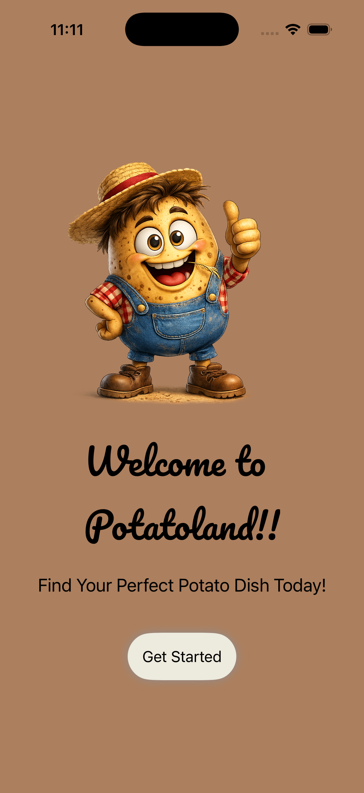
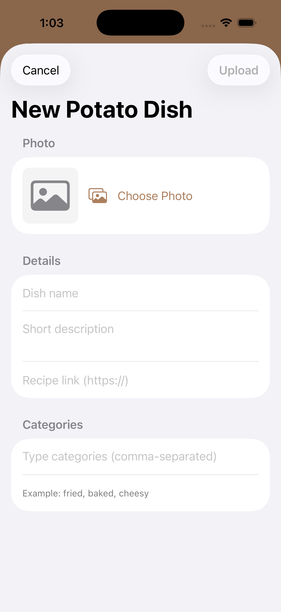
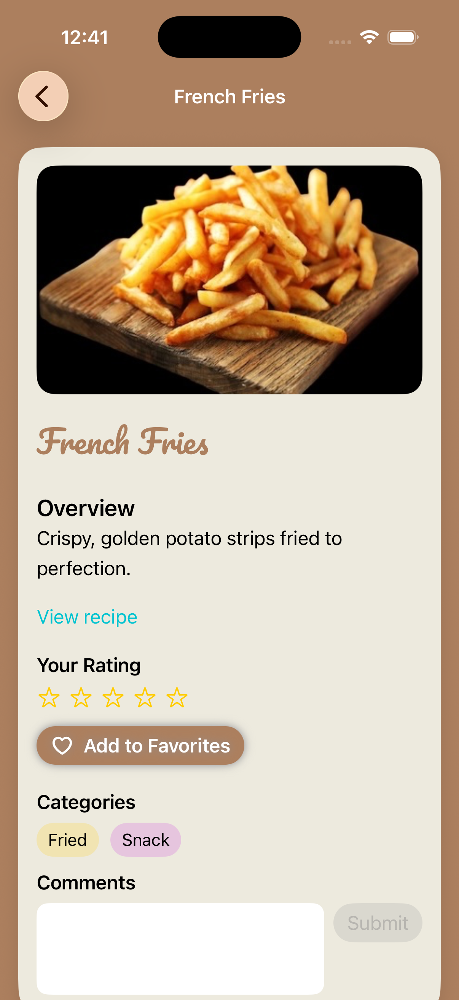

# Potatoland

A native potato dish sharing/recommendations app where users can interact with a collection of potato dishes, or upload and share their own.

## Screenshots

## What It Does
The concept behind this app is a community-based platform where users can **share their favorite potato dishes** with other users, and leave **ratings and comments** on other users' recommendations. For the scope of this project, I created the app as if it were viewed from one user's perspective, instead of dealing with user accounts, but the aforementioned interactive features are still present. When this app is launched, users are greeted by the start screen, where they are greeted by the mascot and a message. Users tap the "get started" button - in this case they are taken straight to their homepage, which is a list of potato dishes whose detailed views they can access by tapping on each list item.

## Key Features
- **External recipe links:** This takes you to a dish's recipe, which launches in the user's default browser.
- **"Add to favorites" button:** This button allows users to "save" their favorite dishes by marking it so a dish appears on the front page with a filled heart symbol indicating that a certain dish has been favorited.
- **Category tags:** Tags allow users to filter potato dishes by the type of dish (e.g. baked potatoes, fried potatoes, etc.).
--**Ratings:** Users can express their thoughts and opinions on the dish by providing a rating out of 5 stars. In this app half-star ratings are supported.
- **Comment text box input:** Users can add their own comments on what they think about each dish.
- **Upload overlay:** This is where users upload their own favorite potato dishes, where they select an image, include the dish name, a short description, a recipe link, and categories.

## Brief Setup Instructions
1. Clone this repository.
2. Locate the **FinalProject.xcodeproj** file.
2. Open the **FinalProject.xcodeproj** file in Xcode. Make sure the latest version of Swift is installed.
3. Run the app and wait for it to load on your selected device simulator.
