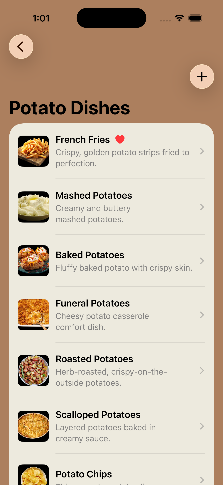

# Potatoland

A native potato dish sharing/recommendations app where users can interact with a collection of potato dishes, or upload and share their own.

## Screenshots

## What It Does
The concept behind this app is a community-based platform where users can **share their favorite potato dishes** with other users, and leave ** star ratings and comments** on other users' recommendations. For the scope of this project, I created the app as if it were viewed from one user's perspective, instead of dealing with user accounts, but the aforementioned interactive features are still present. When this app is launched, users are greeted by the start screen, where they are greeted by the mascot and a message that lets them know what to expect while using this app. Users then tap the "get started" button and are led to the homepage, which displays a list of potato dishes; each dish's detailed are accessed by tapping on each list item. Each detailed view consists of the dish **image**, **name** and a **short description**, an **external link to a recipe**, **star ratings**, **"add to favorites" button**, **category tags**, and a **comments input text box**. Whe "add to favorites" is tapped on a particular list item, that same list item will appear on the homepage with a filled heart symbol indicating it has been favorited. To upload a new dish, users tap the **plus sign button** on the top right of the homepage - this takes users to the **overlay**, where they enter information about their dish and press the "upload" button to send it to the app.

## Key Features
- **External Recipe Links:** This takes you to a dish's recipe, which launches in the user's default browser.
- **Star Ratings:** Users can express their thoughts and opinions on the dish by providing a rating out of 5 stars. In this app half-star ratings are supported.
- **"Add to Favorites" Button:** This button allows users to "save" their favorite dishes by marking it so a dish appears on the front page with a filled heart symbol indicating that a certain dish has been favorited.
- **Category Tags:** Tags allow users to filter potato dishes by the type of dish (e.g. baked potatoes, fried potatoes, etc.).
- **Comment Text Box Input:** Users can add their own comments on what they think about each dish.
- **Upload Overlay:** This is where users upload their own favorite potato dishes, where they select an image, include the dish name, a short description, a recipe link, and categories.

## Brief Setup Instructions
1. Clone this repository.
2. Locate the **FinalProject.xcodeproj** file.
2. Open the **FinalProject.xcodeproj** file in Xcode. Make sure the latest version of Swift is installed.
3. Select your simulator.
4. Run the app and wait for it to load on your selected device simulator.
